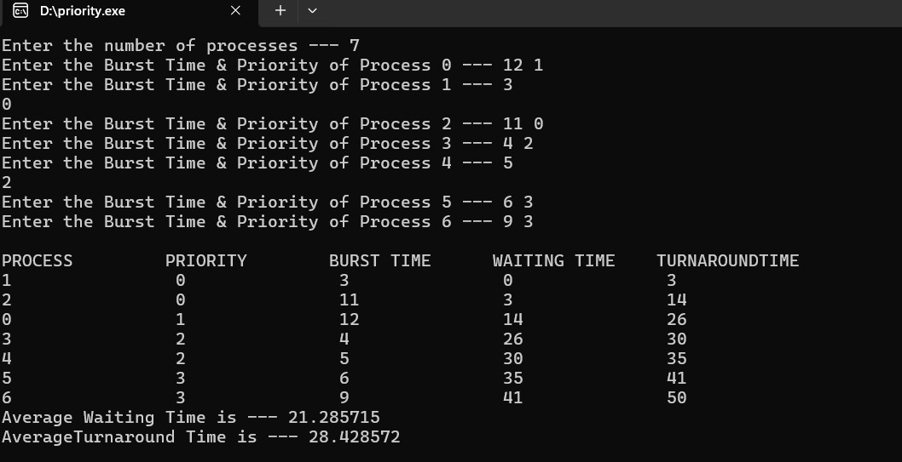

# OS_LAB
LAB PROGRAMS

# FCFS progran status
##program files of FCFS

##sample input and output of FCFS

##tested input and output of FCFS

# SJF progran status
##program files of SJF

##sample input and output of SJF

##tested input and output of SJF

# RoundRobin program status

##program files ofRoundRobin

##sample input and output of RoundRobin

##tested input and output of RoundRobin

# Priority program status

##program files of Priority

##sample input and output of Priority

##tested input and output of RoundRobin

